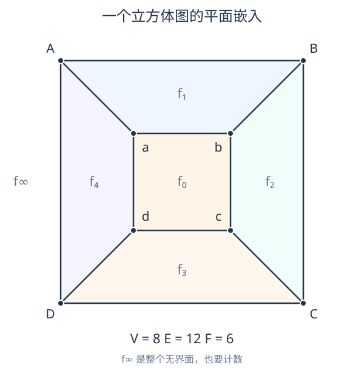
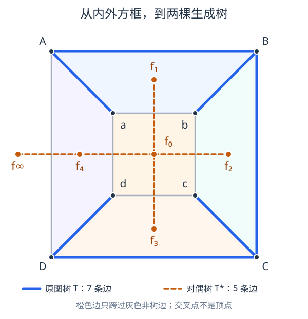
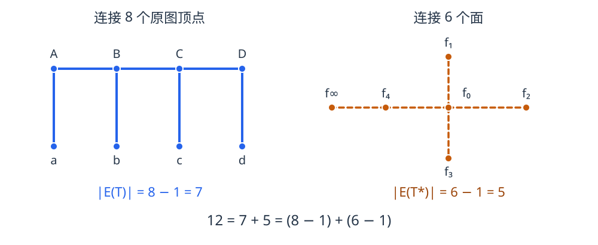

画一个大方框，在里面画一个小方框，再把对应的四个角连接起来，就得到下面这张图。它也可以看成立方体的顶点和棱在平面上的一种无交叉画法。

外圈有四个顶点，内圈也有四个，因此顶点数为 $V=8$。外圈四条边、内圈四条边，再加上四条连接边，边数为 $E=12$。

面数稍微容易数错：中间有一个面 $f_0$，四周有四个面 $f_1,f_2,f_3,f_4$，而**最外面的整个无界区域也是一个面**，记为 $f_\infty$。所以 $F=6$，于是

$$
V-E+F=8-12+6=2.
$$

这个等式不是内外方框恰好产生的巧合。对任意有限连通平面图，它都成立。已经知道的“两棵树原理”，正好能解释这个等式中的每一项从哪里来。

## 先在这张图里找到两棵树

### 第一棵树：连接所有顶点

把外圈顶点依次记为 $A,B,C,D$，内圈对应顶点记为 $a,b,c,d$。选取

$$
E(T)=\{AB,BC,CD,Aa,Bb,Cc,Dd\}.
$$

前三条边组成路径 $A-B-C-D$，后四条边分别把 $a,b,c,d$ 接上去。这七条边连接了全部八个顶点，而且没有圈，因此构成原图的一棵生成树 $T$。

图中用蓝色实线画出 $T$，没有选中的原图边保留为灰色。

### 第二棵树：连接所有面

现在把观察对象从“顶点”换成“面”：在每个面内放置一个点，包括无界面。对于原图的每一条边 $e$，画一条对偶边 $e^*$，连接它两侧的面所对应的点，并且只横穿 $e$ 一次，不穿过其他原图边，也不经过原图顶点。所有这些点和边构成平面对偶图 $G^*$。

这里的面内点不必是几何中心；对偶边也不必画成直线。关键是保留“原图边两侧分别是哪两个面”的关系。

原图中没有选入 $T$ 的边是

$$
E(G)\setminus E(T)=\{DA,ab,bc,cd,da\}.
$$

只保留它们对应的对偶边，便得到上图中的橙色虚线：

| 原图中的非树边 | 对应的对偶边连接的两个面 |
| --- | --- |
| $DA$ | $f_\infty$ 与 $f_4$ |
| $ab$ | $f_1$ 与 $f_0$ |
| $bc$ | $f_2$ 与 $f_0$ |
| $cd$ | $f_3$ 与 $f_0$ |
| $da$ | $f_4$ 与 $f_0$ |

它们以 $f_0$ 为中心连接四周的面，再从 $f_4$ 接到无界面 $f_\infty$，恰好形成一棵有六个顶点、五条边的树，记为 $T^*$。叠加图只画出了这五条对偶边，没有画出完整的 $G^*$；橙色线与灰色线的交叉点也不构成新的顶点。

将两棵树单独抽出来看，关系就更加清楚：

这里有一个必须分清的地方：**剩余边是在转为对偶边之后才构成树。** 在原图中，剩余边 $ab,bc,cd,da$ 明明组成了一个圈，所以不能说“生成树的补集在原图中也是树”。

这个例子呈现的现象是：原图的十二条边分成两组，七条用来连接八个原图顶点，另五条通过对偶关系连接六个面。因此

$$
12=7+5=(8-1)+(6-1).
$$

欧拉公式已经藏在这个分解里了。

## 把例子写成一般命题

设 $G$ 是一个有限连通平面图，即已经固定了一个边之间无交叉的平面嵌入。记其顶点数、边数和面数为 $V,E,F$，其中包含无界面。取平面对偶图 $G^*$，原图边与对偶边按 $e\leftrightarrow e^*$ 一一对应。

**两棵树原理。** 若 $T$ 是 $G$ 的任意一棵生成树，则

$$
T^*=\left(V(G^*),\{e^*:e\in E(G)\setminus E(T)\}\right)
$$

是 $G^*$ 的一棵生成树。

这里 $T^*$ 表示“非树边对应的对偶边所组成的生成树”，并不是把 $T$ 单独视作平面图后再取它的对偶图。

如果已经接受两棵树原理，欧拉公式只需数边即可。下面补上这个原理的证明，说明例子中的现象为什么总会发生。

## 为什么非树边对应的对偶边一定成树

要证明 $T^*$ 是树，需要分别证明它连通且无圈。证明背后的平面拓扑事实是 Jordan 曲线定理：一条简单闭曲线将平面分成内、外两个区域，连接两侧的路径必与曲线相交。

### 对偶边不能形成圈

假设 $T^*$ 中存在一个简单圈 $C^*$。其平面嵌入是一条简单闭曲线。

取圈上的任意一条对偶边 $e^*$。相应的原图边 $e$ 与 $C^*$ 横穿相交恰好一次，所以 $e$ 的两个端点位于曲线两侧。因此，曲线内外都有原图顶点。

由于 $T$ 连接全部原图顶点，$T$ 中必有一条路径连接曲线内外的顶点。这条路径必须穿过 $C^*$，因而存在某条树边 $a\in E(T)$，满足

$$
a^*\in E(C^*)\subseteq E(T^*).
$$

但根据 $T^*$ 的定义，$a^*\in E(T^*)$ 又意味着 $a\notin E(T)$，矛盾。因此 $T^*$ 无圈。

直观上，如果橙色对偶边围出一个封闭圈，蓝色树就无法在不穿过橙色边的情况下连接圈内与圈外的顶点。而我们的选择规则恰好禁止蓝色树边与橙色对偶边相交。

### 对偶边也不能断开

先注意，完整的对偶图 $G^*$ 是连通的：从任意一个面内的点到另一个面内的点，可以选一条避开原图顶点、只有限次横穿原图边的曲线；沿途经过的面给出一条对偶图中的游走。这个事实不需要使用欧拉公式。

现在假设 $T^*$ 不连通。取它的一个连通分量，将这个分量对应的原图面集合记为 $\mathcal S$。由于还有其他分量，$\mathcal S$ 是全部面集合的非空真子集。

考虑两侧分别属于 $\mathcal S$ 及其补集的原图边，组成边集

$$
B=\{e\in E(G):e\text{ 的两侧恰有一个面属于 }\mathcal S\}.
$$

完整对偶图 $G^*$ 连通，所以 $B\ne\varnothing$。而每条 $e\in B$ 对应的对偶边都连接 $\mathcal S$ 与其补集，不可能属于 $T^*$，否则两端就处在同一个连通分量。因此

$$
B\subseteq E(T).
$$

接下来说明，$B$ 必然包含一个圈。

围绕原图的任意顶点走一小圈，依次观察周围的面，并把它们标记为“属于 $\mathcal S$”或“不属于 $\mathcal S$”。每当标记改变，就越过了一条 $B$ 中的边。走完一圈回到原处时，标记改变的次数一定为偶数，所以子图 $(V(G),B)$ 的每个顶点度数都为偶数；若有自环，按通常定义贡献两次度数。

一个非空有限偶度图必然包含圈。否则，它是一个至少含一条边的森林，必然有度数为 $1$ 的叶子，与度数均为偶数矛盾。

于是 $B$ 含圈，但 $B\subseteq E(T)$，这又与 $T$ 是树矛盾。因此 $T^*$ 连通。

综合两步，$T^*$ 包含全部对偶顶点，连通且无圈，所以确实是 $G^*$ 的生成树。

## 最后，只需要数两棵树的边

一棵有 $n$ 个顶点的树恰有 $n-1$ 条边。因此，原图生成树满足

$$
|E(T)|=V-1.
$$

对偶图的顶点与原图的面一一对应，所以对偶生成树满足

$$
|E(T^*)|=F-1.
$$

原图的每条边要么属于 $T$，要么其对偶边属于 $T^*$，两种情况互斥且穷尽全部边。因此

$$
E=|E(T)|+|E(T^*)|=(V-1)+(F-1).
$$

整理得到

$$
\boxed{V-E+F=2}.
$$

等式中的两个 $1$，分别来自两棵树：连接 $V$ 个原图顶点需要 $V-1$ 条树边，连接 $F$ 个面需要 $F-1$ 条对偶树边。

上述结论针对连通图。不连通时，若有 $c$ 个连通分量，相应公式为 $V-E+F=1+c$。此外，对偶图可以出现重边和自环：例如原图的一条桥两侧属于同一个面，其对偶边就是自环；由于桥必在原图的每一棵生成树中，这个自环不会被选入 $T^*$。
